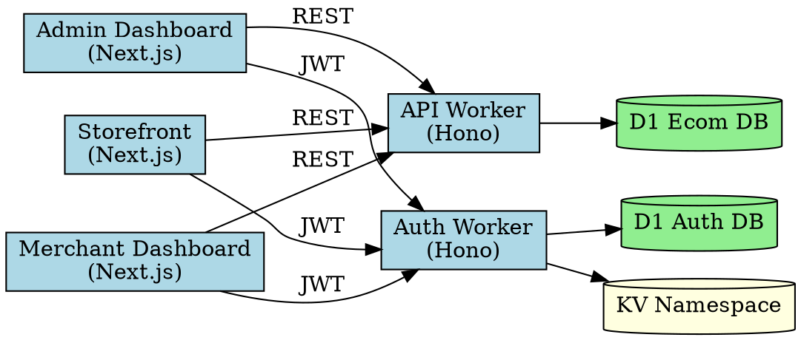
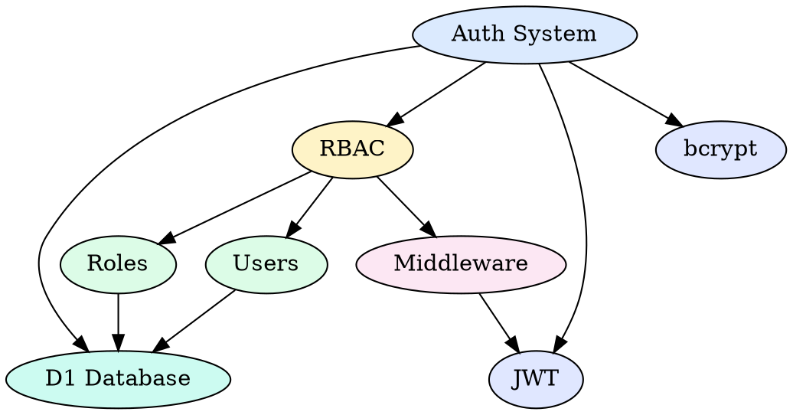
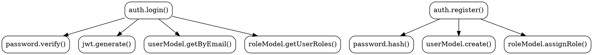

---
name: diagram-graphviz
description: Create Graphviz DOT diagrams — dependency graphs, knowledge graphs, call graphs, tree structures. Use for dependency analysis and knowledge graph visualization.
---

# Graphviz Diagrams Skill

## Purpose
Create dependency graphs, knowledge graphs, call graphs, and tree structures using Graphviz DOT language. Use for analyzing code dependencies, module relationships, and knowledge graph visualization.

## When to Use
- Dependency graphs (module/package dependencies)
- Call graphs (function/method call relationships)
- Knowledge graphs (concept relationships)
- Tree structures (organization, file system)
- Decision trees
- Any directed/undirected graph structure

## Trigger Phrases
- "dependency graph"
- "knowledge graph"
- "call graph"
- "graphviz"
- "DOT diagram"
- "module dependencies"

## Basic Syntax

### Dependency Graph


### Knowledge Graph


### Call Graph


## CLI Usage
```bash
# Install
# Windows: winget install graphviz
# Mac: brew install graphviz

# Render
dot -Tsvg diagram.dot -o diagram.svg
dot -Tpng diagram.dot -o diagram.png

# With layout engine
neato -Tsvg diagram.dot -o diagram.svg  # spring model
fdp -Tsvg diagram.dot -o diagram.svg    # force-directed
```

## Best Practices
- Use `rankdir=LR` for dependency flows, `TB` for hierarchies
- Use `shape=cylinder` for databases, `shape=box` for services
- Color-code by layer (frontend, backend, data)
- Use `style=filled` with `fillcolor` for visual grouping
- Keep under 30 nodes per diagram
- Use `constraint=false` for cross-hierarchy edges

## File Convention
- Save as `<name>.dot` in `docs/architecture/diagrams/`
- Export SVG to `docs/architecture/diagrams/<name>.svg`

