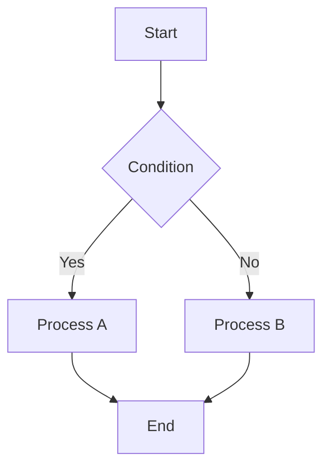
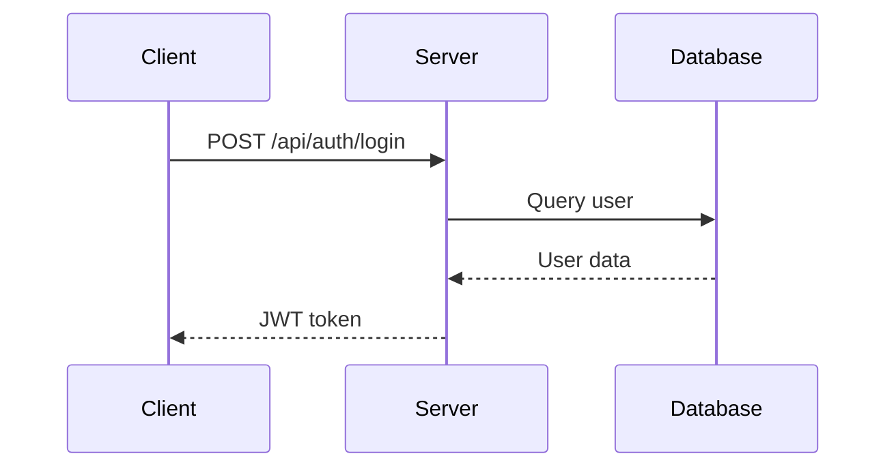
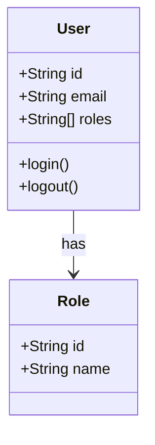
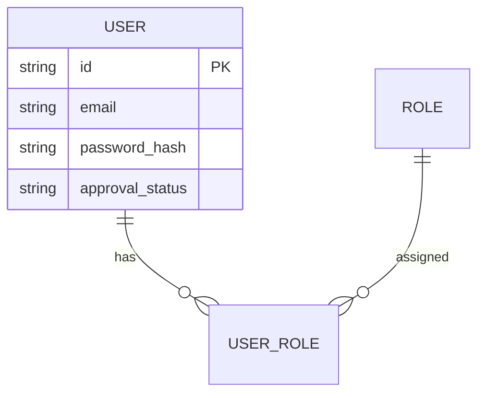
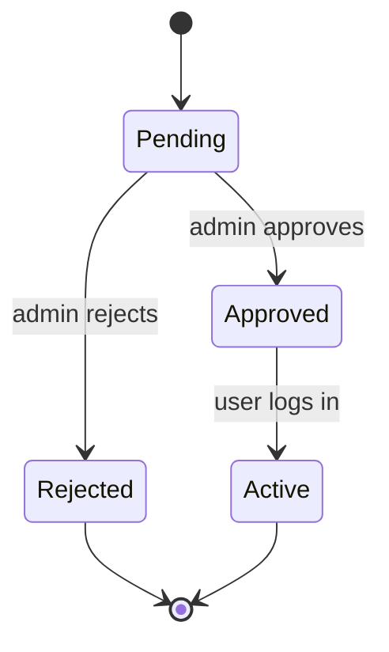
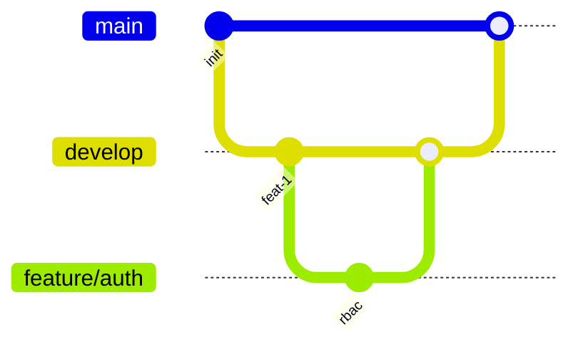
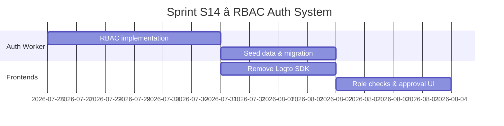
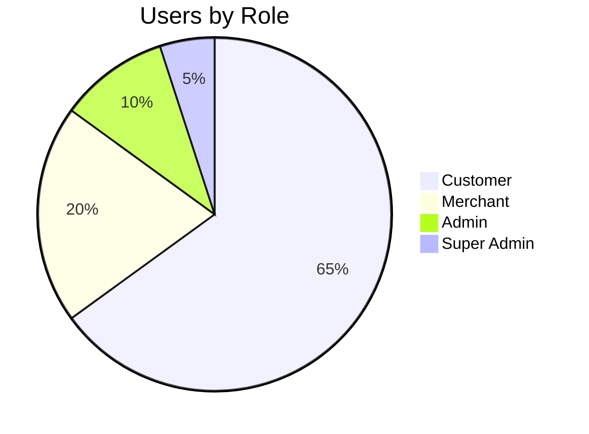

---
name: diagram-mermaid
description: Create professional Mermaid diagrams — flowcharts, sequence, class, ER, C4, state, Gantt, git graph. Use for README docs, architecture docs, and inline Markdown rendering.
---

# Mermaid Diagrams Skill

## Purpose
Create professional software diagrams using Mermaid's text-based syntax. Diagrams render natively in GitHub, GitLab, VS Code, Notion, Obsidian, and Confluence.

## When to Use
- README documentation
- Architecture docs in Markdown
- Pull request descriptions
- Quick prototype diagrams
- Inline Markdown rendering

## Trigger Phrases
- "create a mermaid diagram"
- "draw a flowchart"
- "sequence diagram for API"
- "ER diagram for database"
- "C4 architecture diagram"
- "state machine diagram"
- "gantt chart for project"

## 9 Diagram Types

### 1. Flowchart


### 2. Sequence Diagram


### 3. Class Diagram


### 4. Entity Relationship Diagram


### 5. C4 Architecture (Context)
```mermaid
C4Context
    title System Context Diagram
    person(user, "Customer", "A user of the ecommerce platform")
    system(storefront, "Storefront", "Next.js web app")
    system(auth, "Auth Worker", "Cloudflare Worker auth service")
    system(api, "API Worker", "Cloudflare Worker REST API")
    user --> storefront : browses
    storefront --> auth : authenticates
    storefront --> api : fetches products
```

### 6. State Diagram


### 7. Git Graph


### 8. Gantt Chart


### 9. Pie Chart


## Best Practices
- Use `flowchart TD` for top-down, `LR` for left-to-right
- Keep diagrams under 20 nodes for readability
- Use subgraphs to group related components
- Add styling with `classDef` for color-coded nodes
- Export via Mermaid Live Editor or CLI (`mmdc`)

## File Convention
- Save as `<name>.mmd` in `docs/architecture/diagrams/`
- **CRITICAL**: `.mmd` files must contain RAW Mermaid syntax only — NO ` ```mermaid ` code fences
- VS Code Mermaid preview extensions parse `.mmd` files directly; code fences cause rendering errors
- For inline Markdown (`.md` files), USE ` ```mermaid ` code fences as normal
- Export via Mermaid Live Editor or CLI (`mmdc`)

