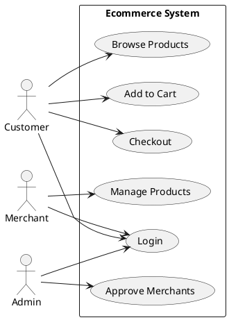
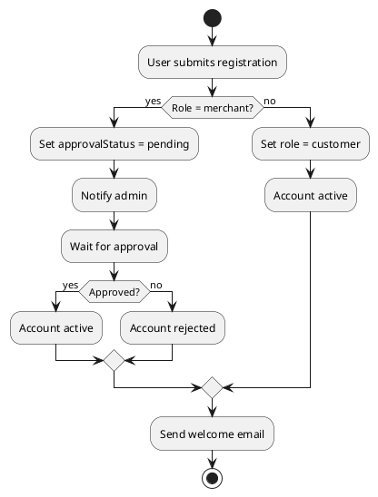
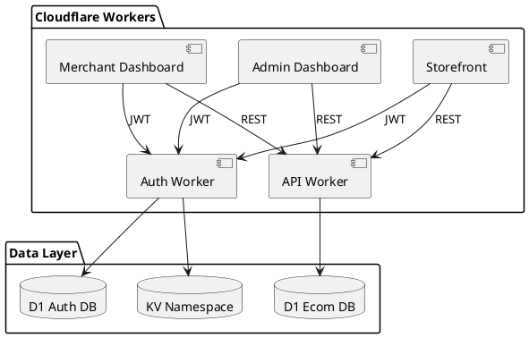
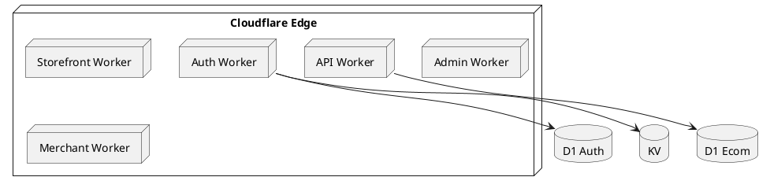
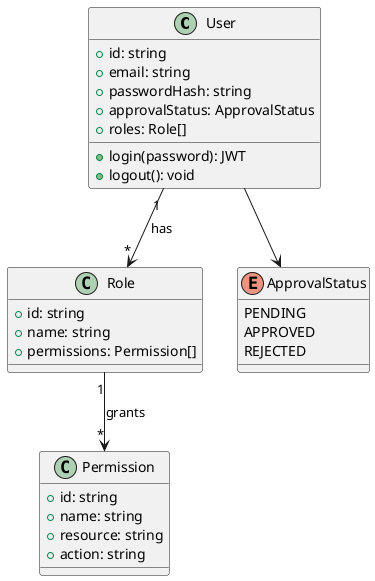

---
name: diagram-plantuml
description: Create PlantUML diagrams — UML class, sequence, use case, activity, component, deployment. Use for RUP and formal UML documentation.
---

# PlantUML Diagrams Skill

## Purpose
Create formal UML diagrams using PlantUML. Use for RUP (Rational Unified Process) documentation, formal UML specifications, and detailed component diagrams.

## When to Use
- Formal UML documentation (class, component, deployment)
- RUP-compliant architecture documents
- Use case diagrams
- Activity diagrams (business process)
- Detailed sequence diagrams with alt/loop/opt blocks
- When PlantUML server rendering is available

## Trigger Phrases
- "UML diagram"
- "PlantUML"
- "use case diagram"
- "activity diagram"
- "component diagram"
- "deployment diagram"
- "RUP diagram"

## Diagram Types

### Use Case Diagram


### Activity Diagram


### Component Diagram


### Deployment Diagram


### Class Diagram (Formal UML)


## CLI Usage
```bash
# Install
npm install -g plantuml

# Generate
plantuml diagram.puml -tsvg

# Or use online server
# https://www.plantuml.com/plantuml/svg/
```

## Best Practices
- Use `left to right direction` for use case diagrams
- Use packages to group components
- Use proper UML notation (arrows, visibility modifiers)
- Keep diagrams focused — one concept per diagram
- Use `skinparam` for styling

## File Convention
- Save as `<name>.puml` in `docs/architecture/diagrams/`
- Export SVG to `docs/architecture/diagrams/<name>.svg`

